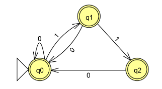

# Automaton Builder

<!-- ## ABDLang

ABDLang (Automaton Builder Description Language) is a language to describe the automatons very inspired on DOT Language. -->

## Initial State
## Final States
## Multiple transitions between same states
## No transitions
## Multiple transitions for a symbol from the same state (non-determinism)
## Empty transitions (non-determinism)

[example.json](./example.json)
